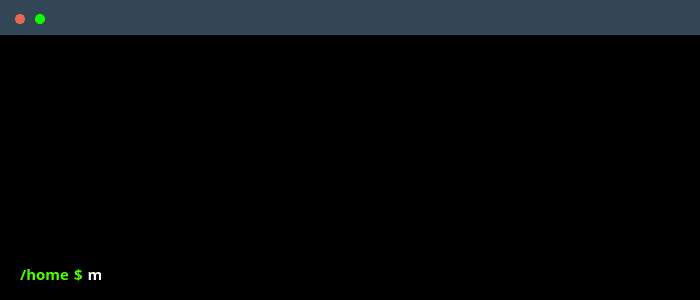

<p align="center">
    <h1 align="center">MMDB</h1>
</p>
<p align="center">
    <em>Create a MaxMind Databases for your own needs.</em>
</p>
<p align="center">
    
    
    <a href="https://app.codecov.io/gh/cercide/mmdb"></a>
    <a href="https://www.codefactor.io/repository/github/cercide/mmdb"></a>
    
</p>
<p align="center">
    <code>pip install mmdb[cli]</code>
</p>

## Features

  + Query any maxmind database: `mmdb get <IP> -d <DATABASE>`
  + Download and build [DBIP](https://db-ip.com/db/lite.php) database [ASN Lite](https://db-ip.com/db/download/ip-to-asn-lite), [Country Lite](https://db-ip.com/db/download/ip-to-country-lite), and [City Lite](https://db-ip.com/db/download/ip-to-city-lite): `mmdb dbip-build`
  + Create an IP database from a CSV file: `mmdb build <CSV>`
  + Logstash [GeoIP Filter Plugin](https://www.elastic.co/guide/en/logstash/current/plugins-filters-geoip.html) compatibility: `mmdb build <CSV> --lsc`
  + Additional country data such as **is_eu**, **is_nato**, or **is_g7**: `mmdb build <CSV> -f country`

## Examples


 
 

## Logstash Compatibility
Logstash ships with the [GeoIP Filter Plugin](https://www.elastic.co/guide/en/logstash/current/plugins-filters-geoip.html)
which enriches a document with IP GeoData. However, the plugin supports specific MaxMind database types only.
As a result, any other database type disables the plugin.

Regarding this, the plag `--lsc` enables logstash support. Long story short:
You get a MaxMind ASN Database, but the IP info as an embedded json string within the
`asn_organization_name` field. The logstash pipeline must load that json data and adds it to
the document, exemplified below

```
filter {
  geoip {
    source => "ip"
    database => "/path/to/my/database.mmdb"
    ecs_compatibility => disabled
    target => "wrapped_ip_data"
  }
  json {
    source => "[wrapped_ip_data][organization_name]"
    target => "myip"
  }
  mutate {
    remove_field => ["wrapped_ip_data"]
  }
}
```
